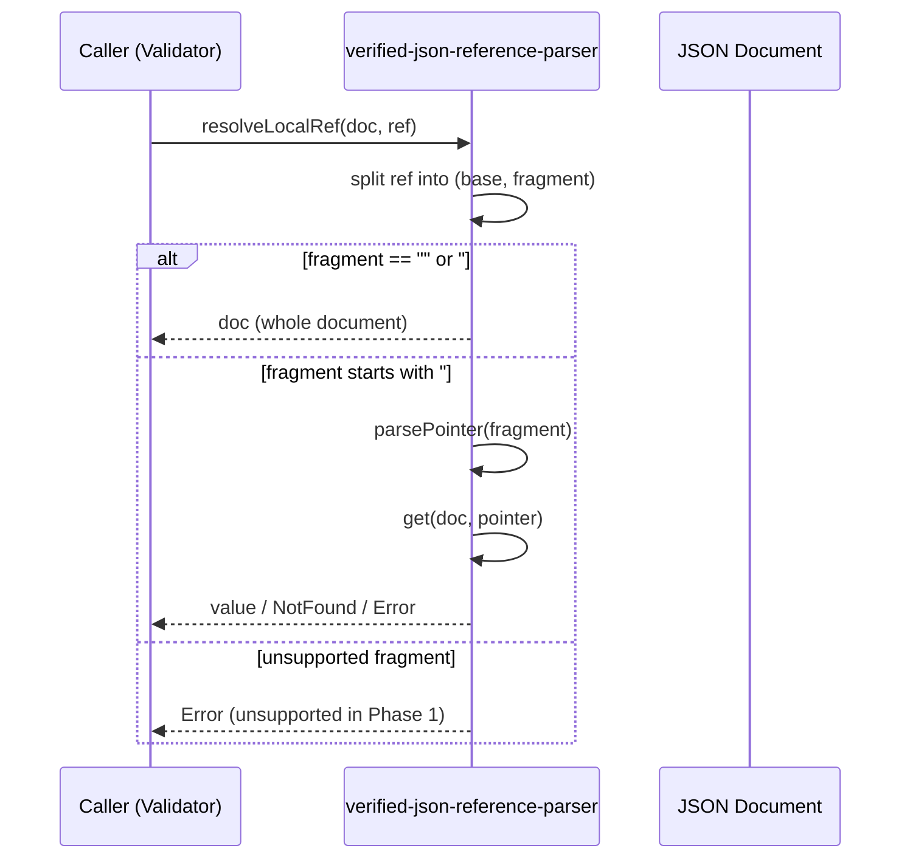

# ARCHITECTURE

## 1. Design Goals

`verified-json-reference-parser` is a small and sharp core library responsible for reference resolution within JSON Schema engines.

This library is intentionally limited to:

* JSON Pointer (RFC 6901)
* Local JSON Reference (`#`, `#/...`)

Its purpose is to clearly define and stabilize the semantics of reference resolution.

Full JSON Schema validation is explicitly out of scope.

---

## 2. Layered Structure

The library is structured into the following conceptual layers.

### 2.1 Public API Layer

This is the stable interface exposed to consumers.

* `parsePointer`
* `formatPointer`
* `get`
* `resolveLocalRef`

This layer prioritizes stability and minimal surface area.

---

### 2.2 Core Semantics Layer

This layer defines the semantic core.

* Internal pointer representation (`readonly string[]`)
* Escaping rules
* Evaluation rules
* Deterministic behavior guarantees

All functions in this layer are pure and side-effect free.

This is the primary target of formal specification and verification.

---

### 2.3 Verification Layer (Development Only)

This layer is not part of the distributed npm package.

It includes:

* Formal specifications written in Rocq
* Differential testing with Z3
* Counterexample generation and minimization

This layer acts as a quality assurance mechanism, not a runtime dependency.

---

## 3. Semantic Boundaries

This library deliberately does not handle:

* JSON Schema keyword evaluation
* External reference fetching
* Network communication
* Full RFC 3986 implementation

URI handling may be introduced in the future only to the minimal extent required.

---

## 4. Role of the Semantic Oracle

Z3 is used in a constrained manner for:

* Modeling JSON Pointer evaluation
* Modeling local reference resolution
* Detecting semantic divergence from the TypeScript implementation

Z3 does not serve as a complete execution engine.
It functions as a limited semantic oracle.

---

## 5. Stabilization Strategy

Once the semantic core is formally fixed:

* Breaking changes to the public API will be minimized.
* Internal refactoring must not alter semantic behavior.
* The semantic layer is intended to remain stable.

---

## 6. Design Philosophy

* Small, clearly scoped responsibility
* Explicit invariants
* Practical assurance over theoretical completeness
* Semantic stability over feature expansion

---

## 7. Diagrams

### 7.1 Data Flow

```mermaid
flowchart LR
  A[JSON Document] --> C[get(doc, pointer)]
  B[JSON Pointer String] --> D[parsePointer]
  D --> E[Pointer (Token Array)]
  E --> C
  C --> F[Value / NotFound / Error]

  R[$ref String (#, #/...)] --> S[resolveLocalRef]
  A --> S
  S --> F
```

---

### 7.2 Differential Verification Flow

```mermaid
flowchart TD
  A[Specification Model / Constraints (Z3)] --> B[Counterexample Generation]
  B --> C[Minimization]
  C --> D[Regression Corpus Update]
  D --> E[CI Execution]

  E --> F[TypeScript Implementation]
  E --> G[Z3 Oracle]
  F --> H{Results Match?}
  G --> H
  H -- No --> I[Report Semantic Divergence]
  H -- Yes --> J[OK]
```

---

### 7.3 Local `$ref` Resolution Sequence



---
