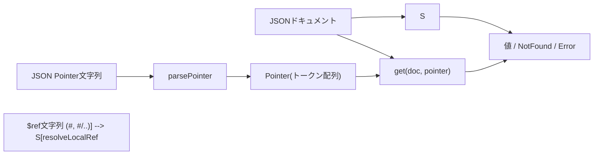
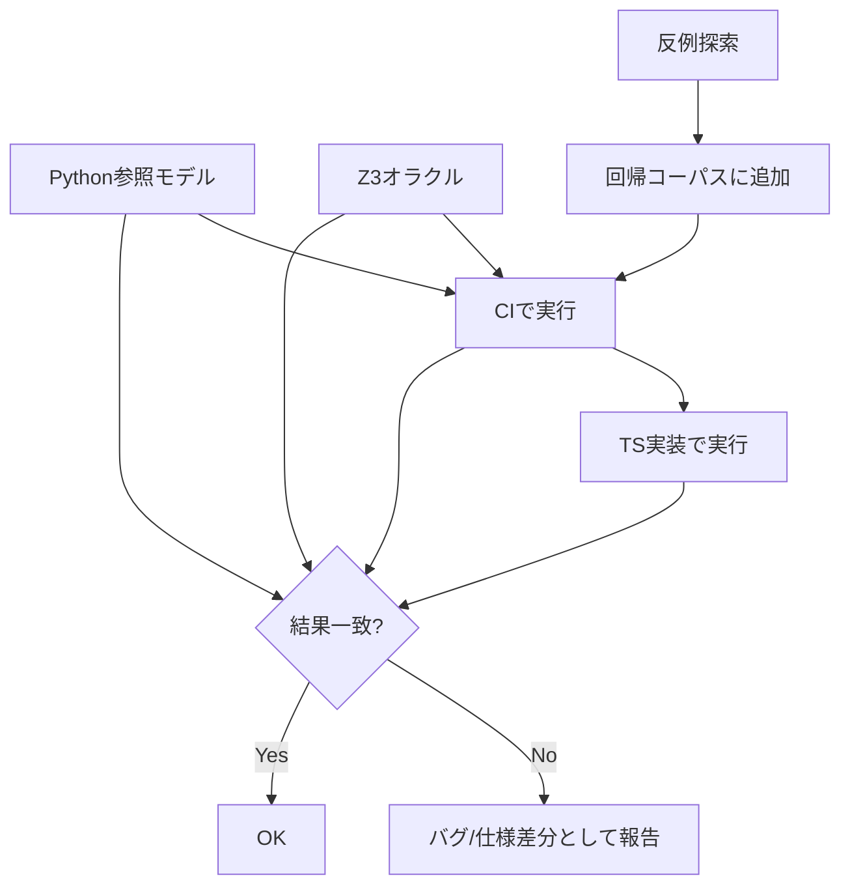
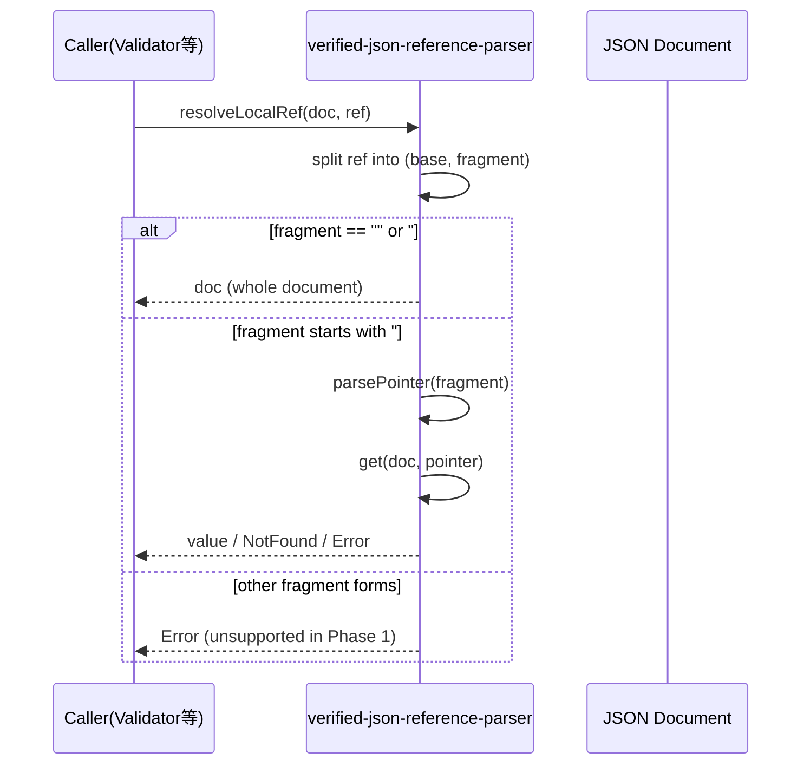

# ARCHITECTURE（設計方針）

## 1. 設計目的

`verified-json-reference-parser` は、JSON Schema エンジンにおける参照解決部分を担う、小さく鋭いコアライブラリである。

本ライブラリは：

* JSON Pointer（RFC 6901）
* ローカル JSON Reference (`#`, `#/...`)

に限定し、意味論を明確に定義することを目的とする。

JSON Schema 全体の検証は対象外とする。

---

## 2. レイヤー構造

本ライブラリは以下の層で構成される。

### 2.1 Public API 層

利用者が依存する公開インターフェース。

* parsePointer
* formatPointer
* get
* resolveLocalRef

この層は安定性を重視する。

---

### 2.2 Core Semantics 層

意味論の中核。

* Pointer の内部表現（`readonly string[]`）
* エスケープ規則
* 評価規則
* 決定性の保証

この層は副作用を持たない純粋関数群で構成する。

ここが形式検証の対象となる。

---

### 2.3 Verification 層（開発専用）

公開APIには含まれない。

* Rocq による形式仕様
* Z3 ベースの Phase 1 具体ケース用オラクル
* TypeScript 実装に対する差分検証
* 反例生成

この層は品質保証装置であり、実行時依存にはならない。

---

## 3. 意味論の境界

本ライブラリは以下を扱わない。

* JSON Schema キーワード評価
* 外部参照の取得
* ネットワーク通信
* RFC 3986 の完全実装

URI 処理は、将来的に必要最小限のみ追加される可能性がある。

---

## 4. 意味論エンジンの位置づけ

Z3 は、以下に限定して使用される。

* 具体的な JSON Pointer ケースの評価
* 具体的なローカル参照解決ケースの評価
* 実装との差分検出

検証レイヤーでは、純粋な Python 参照モデルも baseline として保持する。
Z3 は任意の記号的 JSON プログラムを実行する汎用エンジンではなく、Phase 1 振る舞いに対する限定オラクルとして機能する。

---

## 5. 安定化方針

意味論コアが形式的に固定された後は、

* 公開 API の破壊的変更を最小化する
* 内部実装変更が意味論に影響しないことを保証する

---

## 6. 設計思想

* 小さく明確な責務
* 明示的な不変条件
* 実用的保証の優先
* 拡張よりも意味論の安定を重視

---

## 7. 図表

### 7.1 データフロー図

### 7.2 差分検証フロー図

### 7.3 ローカル `$ref` 解決シーケンス図

---
